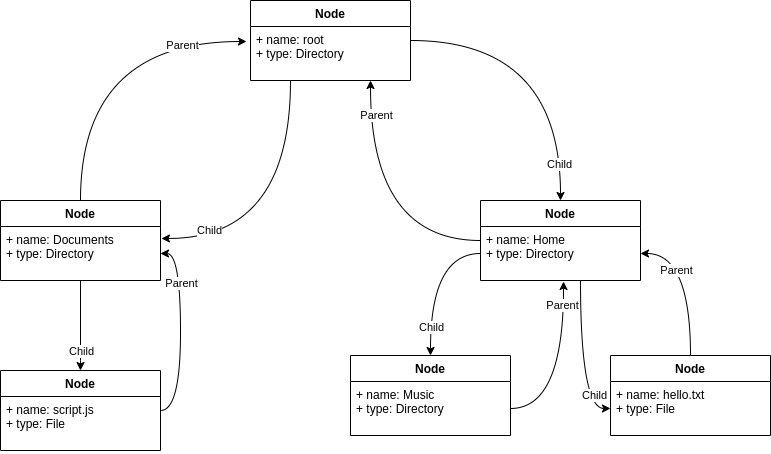

# [JS Terminal](https://jasterv.github.io/TERMINAL-VM/)

This project is based on 2 main objects which allow me to work in a very easy way with the terminal and all the file structure.

## CLI

As we are working on the implementation of a terminal which allows to execute commands, I thought of creating an object which would provide me with all the basic functionalities expected from such a terminal like executing a command, checking if a command exists, printing results in the terminal etc.

For the implementation of each command, I created an object which contains as keys the names of each command and as value all the information about that command including a *run* function to execute it.

This way, to execute any command entered by the user I only need to:

```javascript
    cli.run(command, params);
```

And the object *cli* will be in charge of executing:

```javascript
    commands[command].run(params);
```

The commands accepted by this terminal are: ```**pwd**, **ls**, **cd**, **mkdir**, **echo**, **cat**,  **rm**, **mv**, **clear**, **help**, **man**, **urbandict**, **js**```,

To work with paths, files and directories I implemented an object called *filesTree* which provides me with all the functionalities I need to work with a file hierarchy.

## Files Tree

To develop a terminal that works with files and directories, first I proposed a tree type object that could perform operations such as adding nodes, removing nodes, moving nodes, searching nodes, etc.

This structure is based on a set of nodes, where each node contains a reference to the parent node and, in the case of a directory, references to the children.



Then I can implement in a very fast and simple way any command that is requested as well as *ls* (list child nodes), *mkdir* (create a new directory type node), *mv* (move a node) etc.

In addition, working with a tree structure allows me to navigate between the nodes using very simple recursive functions.

## Local Storage

In the *local storage* both the file tree and the history of entered commands are stored.
To be able to save a circular tree structure like the one we have created (Children nodes save references from the parents and vice versa), we cannot convert to *string* the object directly.
To do that, I have implemented 2 intermediate steps, *serialize* and *deserialize*.

To serialize the tree, I go through it recursively exchanging all the references to an object for an id that represents that object, and I store this id-object pair in a new object.
This way I can save this new object I create in the *local storage*.

To deserialize the tree we do the opposite process. We go through this new object and transform each id to the object it identifies, creating again a tree structure.

## Keyboard shortcuts

+ Up Arrow: See the previous command entered
+ Down Arrow: See the following entered command
+ Ctrl + L: Clear Terminal
+ Tab: Autocomplete with the following available file/directory

## History

To save each entered command we use an array which we save in the *local storage* every time we enter a new command.

## Urban Dictionary API

To call this api from the terminal I have created a command called *urbandict* which receives a word as a parameter.

This [API](https://rapidapi.com/community/api/urban-dictionary) receives the word that the user has written and returns a list with all the existing definitions in the *Urban Dictionary* web of that word.

ENDPOINT: ```https://mashape-community-urban-dictionary.p.rapidapi.com/define```

To ask for the definitions of a word we add that word in the *term* parameter:

```https://mashape-community-urban-dictionary.p.rapidapi.com/define?term=hair```

### API Response

```json
    {
    "list": [
        {
            "definition": "A separate creature that happens to live on your head, hard to [tame]. Ferociously attacking it with scissors, dye or hairproducts may [euthanize] said beast for a short while but beware of [angering] it.",
            "permalink": "http://hair.urbanup.com/4950762",
            "thumbs_up": 186,
            "sound_urls": [],
            "author": "nofu",
            "word": "hair",
            "defid": 4950762,
            "current_vote": "",
            "written_on": "2010-05-09T00:00:00.000Z",
            "example": "[Lizzie] tried hot-ironing her hair to [submission] but oh [woes], it was raining and the beast came out on top in the end anyway.",
            "thumbs_down": 52
        },
        {
            "definition": "A growing substance found mostly [on the head]. Hair is largely [amino] [acid] based and can come in a veriety of colours e.g. brown, ginger, black or blonde.",
            "permalink": "http://hair.urbanup.com/109686",
            "thumbs_up": 527,
            "sound_urls": [],
            "author": "Jim Hodgson",
            "word": "hair",
            "defid": 109686,
            "current_vote": "",
            "written_on": "2003-04-28T00:00:00.000Z",
            "example": "[Tomorrow] I will [comb] [my hair]",
            "thumbs_down": 236
        },
        ...
    },
}
```

## Incidents Record

+ Dividing a *path* into *tail* and *name* has given many problems as there are many *corner cases* that are hard to find
+ Auto complete with *tab* has given some strange behavior but is not a problem for the execution
+ Moving a directory gave problems if the current directory was underneath the moving node. This is now fixed
+ Saving the tree in the local storage gave an error. I have solved it through a serialization process

## Lessons Learnt Record

+ Creation of regex for the split of a valid linux path
+ Serializing and deserializing a tree in a recursive way
+ I have been able to implement one of my favorite data structures since its operations are recursive by nature and I have had a great time :)
